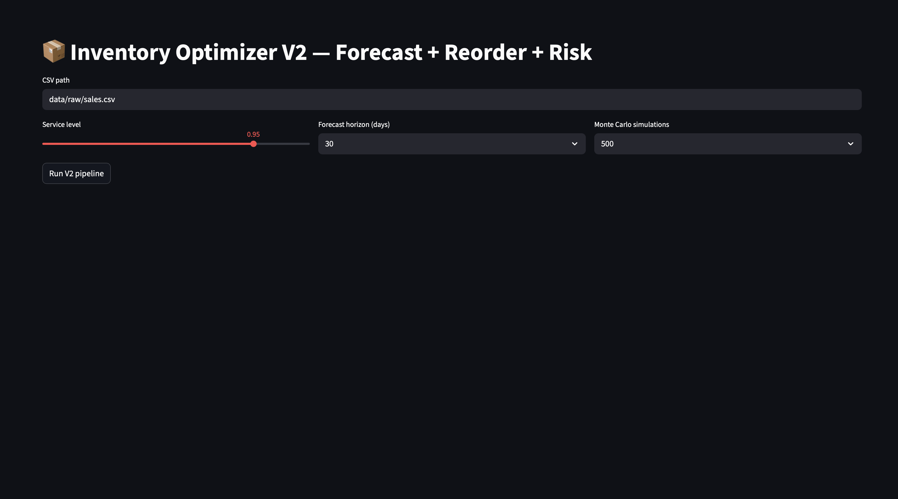

# Inventory Optimizer V2 (Supply Chain Analytics)

A Python supply chain analytics tool that forecasts SKU demand, calculates safety stock and reorder points, and simulates stockout risk using Monte Carlo simulation.

## Features

• Machine learning demand forecasting (Random Forest)  
• Inventory optimization using safety stock and reorder points  
• Monte Carlo simulation for stockout risk analysis  
• Interactive Streamlit dashboard  
• SKU prioritization for replenishment decisions  

## Tech Stack

Python  
pandas  
NumPy  
scikit-learn  
SciPy  
Plotly  
Streamlit  

## Run the Dashboard

cd ~/myprojects/supply-chain-inventory-optimizer  
source .venv/bin/activate  
PYTHONPATH=. streamlit run app/streamlit_app.py  

Then open:

http://localhost:8501

## Project Structure

app/
  streamlit_app.py

src/
  forecast.py
  inventory_policy.py
  simulate.py
  recommend.py

data/
  raw/sales.csv

## Output

The system generates optimized reorder recommendations for each SKU based on:

• forecast demand  
• supplier lead time  
• service level targets  
• simulated stockout risk
